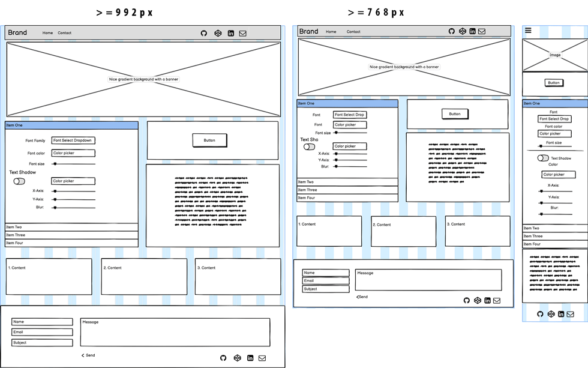

# Welcome

  

## Code Institute: Milestone Project 2

  

### CSS buttonStyler - Daiden Sacha - Full Stack Web Developer

  

* * *

  

Building on the skills used to complete my previous project, my goal is to complete a project with interactive features to engage the user. I've decided to build a site that will offer the user tools to create button styles.
See the [buttonStyler Website](https://daidensacha.github.io/buttonStyler/).

  

## UX DESIGN

  

### 1\. Strategy

  

##### User Stories:

  

-  **External Users** Hobbyists, through to learning and budding developers.

1. As an aspiring developer:

	- I want to play with styles to see what works and what doesn't work.

	- I want to see how the different style attributes work.

	- I want to see how to write CSS for buttons.

	- I want to create button styles on the fly to save time.

	- I want to learn how to design buttons.

2. As a hobbyist who likes to dabble with HTML and CSS:

	- I want to enjoy playing and be able to create buttons easily.

	- I want to see the result as I create it to know what I will have.

3. As a developer:

	- I'm always looking and open to trying tools to make my work more efficient and save me time.

	- I want to be able to enter colors that I am working with to easily create buttons that fit within the colors of my project.

	- I want to be able to play with designs and effects, and colors to discover what is possible.

-  **The Owner** 

1. As the owner:

	- I want to have a tool that makes my job easier.

	- I want to create a tool that I have used online before, but that does things I want it to do.

	- I want to create it to my design preferences and to be able to change it when I want to.

	- I want to be able to add to it and to expand it to improve it.

	- I want to share this tool with others who might also benefit from it.

	- I want to do this project to learn and to be able to put to use the things I have been learning in this last unit.

  

### 2\. Scope

  

Having played on a few of these sorts of sites myself, I know what I find interesting. Also, what makes it an experience to which I would return. Given the limit on time and the abundance of ideas, my challenge is to confine the project's scope to submit it in time.

  

Central to the site will be a playground of features to add styling to buttons.

  

-  **Required Features**

-  **Color picker feature**  \- Users can select colors for the different attributes of the button.

-  **Color Format**  \- Users will be able to enter the color in a text input, in preferred format HEX, RGB/A, HSL/A.

-  **Range Selector**  \- For selecting the size, pixels, distance, etc.

-  **Toggle Switch**  \- A converted checkbox displayed as a toggle switch for enabling or disabling form fields.

-  **Gradient Selector**  \- Gradients are becoming the norm, supported in all modern browsers. A feature is needed for users to choose gradients.

-  **Social Icons**  \- The icons will link to my GitHub, Codepen, and Linkedin profiles.

-  **Contact Form**  \- Users can contact me by using the contact form.

-  **Modal**  \- The Modal will be for the contact form so I can keep the site to one page.

-  **Navbar**  \- Navabar will house the social icons.

-  **Offcanvas navbar**  \- An off-canvas that can be toggled open at any time, not only for small screens.

-  **Accordion**  \- It will have forms of inputs grouped so that users can style the demo button.

-  **Demo button**  \- A demo button to show the styling results visually.

-  **CSS display**  \- An CSS output display that will update as the user styles the button.

-  **Copy to clipboard**  \- A button for users to copy the CSS style.

-  **Footer**  \- Simple Footer with the social links from the Navbar replicated, as above so below.

-  **Functional Requirements**

-  **Color Pickers**  \- Will open when clicked and will have an input so users can enter a specific color if they want. They can also use the mouse cursor to select a color. Form inputs have set default values, so there is a designed button to start.

-  **Range Selectors**  \- The value will be displayed when the user changes it. As a guide, I will set default minimum and maximum values for different attributes for the user.

-  **Toggle Switches**  \- Users will be able to disable or enable some fields of inputs to include or exclude them from the button styling. Not everyone likes a pizza with the works.

-  **Navbar**  \- Fixed Navbar, with a toggle button so users will be able to open the off-canvas and see a list of valuable resources.

-  **Copy to clipboard**  \- Users will be able to copy the CSS style easily, and there will be visual feedback to confirm the Copy is successful.

-  **Gradients**  \- Users will be able to select colors to create gradients. A start color, end color, and a direction are required to compile CSS rules for cross-browser compatibility.

-  **Contact form**  \- Users can access the contact form from the Navbar or Footer. Clicking on the email icon will open the modal with the contact form. It will include validation, and they will be able to send a message. A message will inform the user of the message submission's success or failure.

-  **Accordion**  \- There will be multiple levels of forms containing fieldsets of grouped inputs providing values to compile CSS rules. The user will work through the different style attributes and see the result live as they change the style values. The Accordion will have one Form open at a time

-  **Demo button**  \- The user will add their button text, colors, style attributes by changing the values of the form inputs. The change in values will be updated live to the demo button. The user can change the button's background color to see how it looks against the intended background color.

-  **CSS Output display**  \- The CSS markup will be output into a display next to the Form and below the button.

-  **Content Requirements**

-  **Single page site**  \- Keeping it simple with a one-page site, not overcooked with content. The button styling will be the central focus.

-  **Bling**  \- There will be a full-width banner image to welcome the site user.

-  **Forms within the Accordion**  \- Inputs grouped by CSS rule into fieldsets, laid out sequentially so users can intuitively work through them.

-  **CSS Markup Block**  \- A block within `<pre><code></code></pre>` tags to display the CSS output from selected CSS rules.

-  **Instructions**  \- Simple instructions for users, explaining how easy it is to create, copy, and use the style creator.

  

**Required Form Elements**

  

- [ ] **Color picker:**

- [ ] It was a process to research and select a color picker. There are many around, with varying degrees of documentation, and each has its pros and cons. In the end, my choice was the [jscolor color picker](https://jscolor.com/). It is well documented and has lots of examples showing different possibilities and how to configure them. They are very friendly and offer great support if you have any questions.

- [ ] **Range Selector:**

- [ ] I found some great examples on [CSS Tricks](https://css-tricks.com/value-bubbles-for-range-inputs/) showing different ways to style range inputs and to output the value as it changes. I used one of these in my formes, with some minor changes to the CSS.

- [ ] **Toggle Switch:**

- [ ] I have little experience or knowledge about this element. It's my preferred option to disable form field groups, so users can easily choose styling they want to include. I found the [Bootstrap Switch Button](https://gitbrent.github.io/bootstrap4-toggle/#usage) API available on Github. There is a working example on Codepen with the Bootstrap Range Selector.

- [ ] **Select:**

- [ ] This is pretty straightforward and easy to incorporate. I will use the [Bootstrap Select](https://getbootstrap.com/docs/5.0/forms/select/).

- [ ] **Text Input:**

- [ ] The Form will contain only one text input for entering the button text.

  

### 3\. Structure

  

-  **Interaction Design**

- I think it is human nature to be curious and to want to explore. My vision is that the site will engage and invite exploration to discover available features. It's meant to be an intuitive and joyful experience. Color has a powerful impact on feeling and emotion, so this will be a playground for exploring colors.

- There will be color pickers, range selectors, fonts, a variety of features to tweak the color, size, and style of the buttons to see how the CSS is output.

- The user will be able to play, create a button, and easily copy it to be able to use the exact style where they want to use it.

-  **Information Architecture** Site information arranged as follows.

-  ***Simple and sweet:*** Home page will be colorful. The center point is the forms with inputs for styling the demo button, a playground full of possibilities.

-  ***Contact Form*** I want it simple and don't want users to navigate away from the reason that brought them to the site. So it will be a one-page site, with a contact form at the bottom of the page. I may put the contact form in a modal if, for some reason, it doesn't fit on the home page.

-  ***Social Links*** There will be social links for connecting to me or viewing my work on GitHub, Codepen, and Linkedin.

-  ***Planning*** Given the number of CSS rules to be generated, and corresponding inputs to create the data for outputting the CSS, I have created an excel sheet to use as I put the forms together.

-  ***Layout*** The Layout should be such that the button is visible along with the CSS output so the user can see the result as they change the styles.

  

### 4\. Skeleton

  

-  **Wireframing:**

As I'm be using Bootstrap, I created the wireframes with the Bootstrap breakpoints in mind for small, medium, and large screens. The header row will have a responsive background image. Next comes the row with form block and CSS display block. Followed then by a content block and then the Footer.

I put the contact form in the Footer in the wireframes. However, in the end, I decided to put it in a modal that opens when you click on the email icon.

I combined the three separate wireframes into one image for the README as seeing them side by side gives a better perspective of the scale of difference between the different size screens. The original size wireframes are available for viewing in the assets/images folder.

  

### 5\. Surface

  

**Visual Design:**

Color. Fun. Exploration. I want to take off my conservative hat and be a little daring to create an impression, definitely an experience to remember. It should be a fun experience to play with the button creator, one that the user will remember and return to when they next need to check out button styles.

  
  

## TECHNOLOGIES USED

  

* * *

  

***Languages Used***

  

1. HTML

2. CSS3

3. SCSS

4. JavaScript

5. jQuery

6. Markdown

  

***Frameworks, Libraries, Programs used***

  

1.  [Bootstrap](https://getbootstrap.com/)
 Framework used to create a responsive website.

2.  [Font Awesome](https://fontawesome.com/)
 Icons used for the social icon bar and the Copy to clipboard button.

3.  [Google Fonts](https://fonts.google.com/)
 I chose a selection of Google Fonts to use in the "select" input for selecting CSS font style for the button styling.

4.  [GitHub](https://github.com/)
 Used to host project repository and to deploy the project live via GitHub Pages

5.  [Git Version Control](https://git-scm.com/)
 Used to commit blocks of work to the project and created branches for working on specific changes or testing.

6.  [Clipboard.js](https://clipboardjs.com/)
 Use Copy (add to clipboard) functionality for the user to copy the CSS markup.

7.  [Balsamiq](https://balsamiq.com/wireframes/?gclid=Cj0KCQjwgtWDBhDZARIsADEKwgNq0GvC2yRLIRMqtOQmJMttVQwRQwncxUgML3HMPxy17ZF6--foTYkaArnQEALw_wcB)
 Used to create wireframes

8.  [Adobe Illustrator](https://www.adobe.com/de/creativecloud.html?mv=search&mv=search&sdid=MQH8S7GK&ef_id=Cj0KCQjwgtWDBhDZARIsADEKwgPZA7lnHvCbzk4T9-Q7HVENkRXnk1GxIseaWipJrYnWF0LQvFTw21MaAlQ6EALw_wcB:G:s&s_kwcid=AL!3085!3!392740825380!b!!g!!%2Badobe!1419110055!55481570853&gclid=Cj0KCQjwgtWDBhDZARIsADEKwgPZA7lnHvCbzk4T9-Q7HVENkRXnk1GxIseaWipJrYnWF0LQvFTw21MaAlQ6EALw_wcB)
 Used to edit and resize vector used for the banner background image.

9.  [Adobe Photoshop](https://www.adobe.com/de/creativecloud.html?mv=search&mv=search&sdid=MQH8S7GK&ef_id=Cj0KCQjwgtWDBhDZARIsADEKwgPZA7lnHvCbzk4T9-Q7HVENkRXnk1GxIseaWipJrYnWF0LQvFTw21MaAlQ6EALw_wcB:G:s&s_kwcid=AL!3085!3!392740825380!b!!g!!%2Badobe!1419110055!55481570853&gclid=Cj0KCQjwgtWDBhDZARIsADEKwgPZA7lnHvCbzk4T9-Q7HVENkRXnk1GxIseaWipJrYnWF0LQvFTw21MaAlQ6EALw_wcB)
 Used to combine three wireframes into a single image for the README.

10.  [EmailJS](https://www.emailjs.com/)
 Used to process and send contact form information.

11.  [Visual Studio Code](https://code.visualstudio.com/)
My editor of choice. My project was created and worked on locally and then pushed up to GitHub using terminal Git push.

12.  [Joplin](https://joplinapp.org/)
 A free, open-source note-taking and markdown application for OSX, iOS, Linux, Windows. I used it to create the README file for GitHub

13.  [Squoosh](https://squoosh.app/)
 Used to compress images to optimize load performance.

14.  [jscolor Color Picker](https://jscolor.com/)
Color pickers are used on the website for choosing colors.

15.  [shoelace](http://shoelace.io/)
Application for building Bootstrap grids. It is a convenient tool that simplifies building the responsive grid.

## Testing

### Research
***

**1. Whats available?  
2. How does it work? 
3. What can be expected?**
The three questions I needed answers to in order to start my project. I never used or worked with range selectors, color pickers, or toggle switches, so I need to experiment to at least have some understanding. 
My initial strategy was to research, and use Codepen to implement working features, to see how they work. I wanted to learn this before writing any code. There are several pens where you can see what I was playing with and you will understand what I have put into the site. 
- [Toggle Switch disables fieldset of form inputs](https://codepen.io/daidensacha/pen/yLgzojL) An experiment in styling a toggle switch and using it to disable the fieldset of form elements.
- [Toggle Switch disabling form fieldset,](https://codepen.io/daidensacha/pen/OJWxmvP) In this example, I was outputting the boolean of the toggle switch and fieldset disabled state. 
- [Comparing a toggle switch and checkbox.](https://codepen.io/daidensacha/pen/RwKKWbJ) I was also comparing the use of JavaScript vs. jQuery for disabling the inputs. 
- [Toggle switch, range selectors, and color picker](https://codepen.io/daidensacha/pen/ZELexZB) Here I was playing with the positioning of the Form with the different features that I wanted to put in it.
- [Bootstrap 4 color pickers](https://codepen.io/daidensacha/pen/jOyVrqW) This was my initial choice, but I moved away from it after experiencing some conflicts and bugs that I couldn't work out. With limited time, my decision to use jscolor color picker was a good one. 
- [Bootstrap Offcanvas](https://codepen.io/daidensacha/pen/QWdvyBd) based on a demo version from Bootstrap.

In this preliminary testing phase I was able to choose what I felt would best suit my needs to create a product that would fullfill my goals established in outlining the 5 planes of UX.

### Development
***
#### Git Version Control
- **Initialise Git** 
To begin my project I started with `git init` to initialise git within the project. 
- **Git Ignore**
I created a **.gitignore** file so I could add files or directories I didn't want uploaded to GitHub.
`git echo "file_name" >> .gitignore` is the terminal command I used to add files and directories to **.gitignore**.
- **Incremental Commits** 
I incrementally commited my work in blocks with  meaningful commit explanations that are easy to reference to see the work that was completed. 
- **Created branch for form.js**
Writing the JavaScript to process the input values, generate the CSS styles and output the CSS styles to the demo buttona and CSS block was a major part of my code. When I finished completing the forms of inputs, I created a branch `add-colorpickers` as my development branch for writing the javaScript to process the form values and output the CSS styles. it was a fallback in case things went wrong and I needed to start again.
`git -b add-colorpickers` created the branch.
`git checkout add-colorpickers` moved me into that branch to write my code.
`git branch` displayed the list of branches, with an asterisk bedide the branch that I was currently in.
`q` quit the git log mode.
- **Merged form.js to master branch**
When I had completed the code for implementing the CSS functions, I merged the branch with the master branch. 
To ensure my branch was merged into the master, I moved to the master branch.
`git branch` showed me the current branch I was in.
`git checkout master` moved me to the master branch.
`git merge add-colorpickers` merged the branch into the master branch. 
   

#### HTML
- GOAL: Implement an accordion, containing forms with fieldsets of inputs grouped to provide the values needed to formulate CSS rules.  
	 - I created the accordion first, and tested that it worked bu clicking on ech part to ensure that the others were closed and only the clicked part would open. 
	 - I Working through one level at at time I added the inputs along with their labels and the headings, to ensure the layout was accoring to the plan. Using Chrome DevTools I tested the layout at different breakpoints to see that the layout remained as required 
	 - My gol at this preliminary stage was only to ensure the inputs were in place and worked, but was not yest concered about processing the values of individual inputs. 
	 - Having created the accordion, I then put the demo button in place with the block below it that would display the CSS. 
	 - I was not concerned with styling, but it was important that the structure was in place, and displayed properly at different breakpoints. 

#### JavaScript 
-	With 1 text box, 3 selects, 11 color pickers 13 range selectors and 6 toggle switches, the accordion forms with inputs were going to be my greatest challenge to implement. It was the central part of the project, so this is where I started. I had no idea how much time it would take. 
	-	Toggle switches. 
		- The starting point was to implement the toggle switches, so that they enabled or disabled form inputs, or fieldsets, depending on what was needed. Initially I tried using fieldset class names on the inputs, however the result was not consisited and it was unpredictalble. I tried to disable the fielset directly, and it worked but not on the color pickers. I also found that jQuery worked for this but could not get JavaScript to do the job. In the end, what worked was using jQuery targeting the ID names of the inputs, along with disabled = true/false.
		- I tested the toggle switches at this point to ensure that fielsets disabled or enabled. The input enabled/ disabled states were styled differently so there a visual change to confirm it was working. 
	-	Text input
		-	I wrote the function to listen for a `keyup` event, and to take the input value and insert it in the demo button. When I entered any letter in the text field, it was immediately shown in the button. There was an issue when the input text was deleted, the button reduced to a small circle. I added an if statement to check if the input value was an empty string, and to set a value to the button if it was true. This corrected that bug. 
	***	
	**Obstacle and rethink**
	The first four inputs, for button-text, font-family, font-color, font-size, were all added directly to the button, and I quickly discovered this would not work as pseudo css classes cannot be added directly to an element using JavaScript. In addition, my plan to add spans to the CSS block for the button style attributes was complicated.
	I need to research to see if there was a better way.
	
	**The Solution**
	 1. [Create a style element, append it to the HEAD, and insert the CSS.](https://dev.to/karataev/set-css-styles-with-javascript-3nl5) 
	My solution was based on the information in the above link. The CSS style is reflected directly in the demo-button, and output live to the CSS display block.  
	 2. `function update()`
	I came across this function on [Stack Overflow](https://stackoverflow.com/questions/55940670/how-to-get-slider-range-value-and-store-it-in-a-variable-within-javascript/55940824) when researching how to get the value of the range slider and to display it as it changes. There is information online and at [MDN Web Docs](https://developer.mozilla.org/en-US/search?q=.update%28%29). 
	Used together with `onchange` or `oninput` event listeners, it is a powerful function that listens to my form inputs and updates values. 
	The Javascript that processes the form input values and creates the CSS rules is within the `function update()` in form.js.
	***
	
	**Onwards with the new plan**
	It was time consuming, but the plan was clear, and easy to implement. It also worked beautifully. I wrote the code in parts, querying selectors, assigning variables, and checking in the DevTools console for error feedback.

	My testing in this part of writing the code was to ensure that inputs were assigned to variables, the values of those inputs were then assigned to variables, and then combined by groups to create the CSS rules. Console.log was my way to see the code was working.

	Once I had completed the code in form.js, I was able to see the result in the demo button style, and the CSS Output display. At that point I was able to go one by one through the form inputs, fieldsets, and test them to see if they were working. I bug that I thought was resolved had returned, the disabling of the color inputs was not working again.

 	**The Pesky Bug** 
	I had added `oninput update(); `to all the form elements, and it worked for the inputs, but my toggle switches were not working properly. I dove into the console, lookingn for errors, but none were showing. Clicking on the toggle switches was not triggering the `update()` function. In an aha moment, i clicked that the toggle is basically a checkbox, so I changed the event listener to `onchange update()`, and bazinga! The bug dissapeared and the toggle switches started working. 
	
**Contact Form**
	When I click on the contact icon in the navbar, or the footer, a modal appears with the contact form. If I click send, a message appears asking me to enter my name, as all and the same for all other fields as they are all required. With all fields completed, when I click send, the form fields empty, and a success message appears saying the message has been sent. It then disappears after 2 seconds. 
	
**Social Icon Block**
	When I click on the GitHub, Linkedin, or Codepen icon in the header or the footer, it opens linked pages in new tabs in the browser.
	
**Off Canvas**
	When i click on the navbar toggle icon, the offcanvas opens. The toggle icon is always visible, so the offcanvas can be opened to reveal a list of links to resources used to create the site. 
	When I click on a link it opens the webpage in a new tab.
When I click anywhere other than on a link, the offcanvas closes. 
	
**Scroll to top**
	When I click on the "to top" icon in the footer, the page smoothly scrolls to the top of the page. 
	
#### Testing the inputs 
- Select
	-	I click on the font-family select, choose a font, and the font in the demo button changes immediately. The font-family displayed in the CSS display block is also updated at the same time.
	-	When I click on the "select direction" for the gradient background and select a different direction, the gradient direction changes accordingly, and the changed CSS rule is also output to the CSS output block. This meets an outline need in the user stories for all users to see what how syles work, what effect they have, and also see the CSS and out it is written. 

- Color input
	-   I click on the color input, the color picker popup appears. I selected a color with the mouse cursor, the color changes in the demo button display and the color RGBA value is displayed in the CSS Output block. 
	-   In the developer user stories, I identified the need for the developer to be able to enter specific colors for button values. In the color picker input I added different values, HEX, HEXA, RGB, and RGBA. The color in the color picker immediately changes to the color that was entered. This confirms the color pickers accept different color formats, and meets the need of the developer. 

- Range selector
	- I clicked on font change range selector handle, dragged it and the value changed, immmediately increasing the font size in the demo button. 
- Toggle switch
	- I clicked on the disabled text shadow input, it does not open. This confirms the bud is not there anymore. I click on the toggle switch, the default text shadow is immediately visible on the demo button, and in the CSS output block. The text shadow fieldset is enabled, and I can select the color, range selector x-axis, y-axis, and blur. When I select a different color, or x-axis, y-axis or blur value, they change the style of the demo button and the corresponding value is updated in the CSS output block. 

I checked all the inputs and fieldsets individually to confirm that they are all working as expected. 

**Demo Button Background issue**
When I change the font size, the button gets bigger, however the background does not incorease in size. I had set a fixed height of the background, and though using DevTools I removed the fixed height, and added a top/bottom margin on the demo button. Now when I increase the font size, the button increases in size along with the background. 

**Demo Button Display**
When I scroll the button disappears off screen. I added the boostrap sticky-top class to the demo button background div. The button and background now sticks to the top of the screen and remains visible for longer. It is more friendly. 

**Copy to clipboard function**
In the user stories I identified the users need to be able to easily copy the CSS style. I added an icon to the top of the CSS output block, and implemented clipboad.js. When I click on the icon, a message appears confirming the copy success, and at the same time, the CSS is highlighted. I created a codepen where the user can paste the CSS to see it work, and the link to the codepen is under the CSS block highlighted under the heading "Copy the CSS". Pasting the CSS in the codepen creates an exact copy of the button that was ceated using the Button Styler. 

In user stories I identified the need to be able to easily copy the CSS to be able to use it. Users can copy easily, as shown in the image above. Thez can then test the code in a codepen I created. Users can paste the CSS into the codepen, (link below the CSS dsiplay block) and see it work. 

**Demo button Styles**
When I change any of the form input values, the change is immediately displayed in the demo-button style. Clicking on a toggle switch adds or removes the corresponding styles to the button. Selecting a different input color changes the corresponding style color of the demo-button. The changes are live and immediate. 

**CSS Display block**
All enabled CSS rules are displayed in the CSS display block under the demo button. Then the input vlaues are changed, I see the CSS rules are immediately changing. Enabling or toggling between differnet options also adds or changes the CSS rules that are displayed. 

**Included CSS Styles**
- FONT 
	- Button Text *(accepts 3-16 letters, plus spaces)*
	- font-family
	- color
	- font-size
- SHADOW
	- text-shadow *(default off, toggles on)*
		- x-axis
		- y-axis
		- blur
		- color
- BOX
	- box-shadow *(default off, toggles on)*
		- x-axis
		- y-axis
		- blur
		- color
	- padding *(default "all-sides",  toggles to "top-bottom/right-left")*
		- all sides
		- top-bottom
		- right-left
- BORDER
	- color
	- border-width
	- border-radius
- COLOR
	- background *(default solid color, toggles gradient on)*
		- color
		- gradient color 1
		- gradient color 2
		- gradient direction
- HOVER
	- font-color
	- background *(default solid color, toggles gradient on)*
		- color
		- gradient color 1
		- gradient color 2
		- gradient direction
	- border *( default on, toggles off)*
		- color
		- border-width

There is a variety of properties and options to choose. The inputs are easily accessable and work seemlessly. The effect is immediate. Change the value, the style change appears in sync in the demo button, and the CSS appears live in the CSS display block. In the user stories I identified the need to play with the effects, to see how they work, and to learn how to write the CSS to create button styles. Button Styler as a learning tool offers hobbyists, aspiring developers, and developers learning playground. The CSS is easily copied if the user wants to use it, a need also identified in the user stories. 

**Responsive Design**

[Bootstrap Breakpoints](https://getbootstrap.com/docs/5.0/layout/breakpoints/) 
|Breakpoint|Class infix|Dimensions | 
|--|--|--|
| X-Small | _None_ | <576px |  
|Small|sm|≥576px|
| Medium | md | ≥768px|  
|Large|lg|≥992px|
|XL|xl|≥1200px|
|XXL|xxl|≥1400px|

 Throughout the development stage, the display was tested in Chrome DevTools, for each of the screen sizes. Writing the HTML, the focus was on positioning of the form inputs, with the labels to ensure they were correctly positioned. 

**HTML/CSS/JS Validation**
Before deploying I validated the sites code in the  [W3C HTML validator](https://validator.w3.org/), [W3C CSS Validator](https://jigsaw.w3.org/css-validator/), [JSHint JS validator](https://jshint.com/) . Some minor issues were identified. A clash between Boostrap and HTML5 use of the footer tag. As Bootstrap framework is class dependent, it was no issue to remove the footer tag from the blockquote and replace it with a `
` tag. CSS validated with no issues. JS was missing some semi colons. 

With testing completed to a point where I needed to have the site live to be able to test further and to share the work to get feedback, I moved to the deployment phase.

### Production/ Deployment
***

**Deploy to GitHub Pages**

The time arrived to depoy the site live so I could move to the next phase of testing. I needed the site to be live so I could test it on the GitHub server. I could also share the link to get feedback. 

1. Click `Settings` on the repository page.
2. Click on the GitHub Pages tab to the left. 
3. Under source, click the dropdown, select `master`, or the branch of your choice. 
4. Click save, and the message shows, "Your site is ready to be published at https://daidensacha.github.io/buttonStyler/".

Having the site live enables me to dive deeper into testing and exposing it to external users with different insights. 

**Production Strategy:**
1. Test the site on the live server to see that it is performing as expected, as it was on the local server. 
2. Run the site code through HTML/ CSS/ JS validation to check it validates. 
3. View the features with a critical eye, test the site as a user to see if it fullfils my expectations.
4. See what works, what doesn't work, and what can be impoved.
5. Share the site with friends, colleagues, mentor, and other developers to get feedback and input.

**Personal Testing Devices/ Software/ Browsers**
- Macbook Pro (15-inch)
	- macOS Big Sur 11.2.3
		- Safari
		- Chrome
		- Firefox
	- Windows 10 (bootcamp)
		- Safari
		- Chrome
		- Firefox
- Dell 2419 Monitor
- iPad Air
- iPhone 11 Pro

**Issue 1 - No images** 
I had an issue with my background images not showing up. When I created my site folders, I mistakingly named the images folder "Images". All my image links were to the "images" folder, and I don't know why, but Chome on my local server was forgiving and displayed my images. GitHub on the other hand, is a little more pedantic. My images were not showing. 
It was a littel complicated. I moved all my images to back them up, deleted the "Images" folder, created a new "images" folder, moved images into it. 
Terminal  `git add .`, `git commit -m "fixing incorrect folder name"`, and `git push`. Finally, images were showing. 

I don't know if this is a normal experience, but viewing the same site in Chrome, the local version was viewing perfectly, but the GitHUb Pages version was presenting the same website. Suddenly, I was not trusting my local server setup.

**Issue 2 - Margins**
I wanted my accordion/ CSS block row to fold at `sm` screensize, for the columns to stack and the side margins to be gone, as they are a waste of space on mobiles. I was getting x-overflow, and it had me stumped. 
I had put flex class on the `container-fluid conatiner-flex`, instead of the child `row row-flex`. What I found out is that if you do that, Bootstrap columns add a negative margin to make up for it, hence the overflow. I moved the flex to the row, the margin was not there on xs screens, and there was no overflow. 

**Issue 3 - Padding** 
At this point I noticed that the DeveTools iPhone X was displayed really differently to my iPhone 11 Pro. Same iwth my iPad. I was getitng padding viewing the live site that was not showing in DevTools. One issue was of my own making. When I started I set a fixed height of the button background, so it was fixed height and did not look nice when the demo buttons font size was increased. It was out of balance. I changed it to min-height with fixed padding top and bottom, and it was looking good. 
Other issues were jsut to refine the styling for xs and Tablet screens, so that the padding was not there. This was just a process of editing, checking, playing, and so on. 

**Stacking column oder**
On Bootstrap xs screensize the demo button and CSS block was stacking under the accordion. It didn't look right, as the buttom should be at the top. 
I used the Bootstrap oder class to move the second column to `order-1 order-lg-2`, and the accordion column to `order-2 order-lg-1`. This fixed the issue.

**Class sticky-top**
Next issue was that on the iPhone and iPad, and the larger screens but to a lesser extent, when scrolling the demo button scrolled off screen very quickly. 
I added the Boostrap class `sticky-top` to the demo button column, which stopped it moving off screen untill the whole block was scrolled off screen.

**Text Input**
When the user enters text into the text input, it automatically shows in the demo button. I had a default value for the demo button, `My Button`, and placeholder text in the input `Your button text`. When clicking in the text input, and pressing delete, the demo button collapsed to a small circle. I added an if statement to check if teh input value was an empty string, and if yes to use the default value in the button. After some more research, I added Regex validation, to accept 3-16 letters, lower or upper case, with spaces. If it does not match it displays a message `enter 3-16 letters only`. Otherwise the default demo button text is displayed. 

**Feedback**
**Jürgen Jung** - *Software Engineer*.
I gave the link to Jürgen so he could test the button styler and get to his feedback. The feeback was positive. He used it to ceate a button, copied it using the copy to clipboard and pasted in to the codepen. He said it functions really well, and it inpired him to learn more HTML and CSS.

**Jan Odvárko** - *Developer: jscolor*
Very well done, Daiden, that's an impressive piece of work.
Just tried it in Chrome and it works like a charm.
Thanks for sharing it with me and I wish that your application helps many people to generate nice buttons.

**CREDITS**

* * *

Throughout my project, I was continually challenged to research and learn, to draw upon the vast treasure of experience so widely shared online to fill the gaps in my knowledge. I would like to thank and give recognition to the following resources that contributed to my project.

-  [Bootstrap 4.6](https://getbootstrap.com/docs/4.6/getting-started/introduction/) - I used 4.6 as 5.0 was still in alpha, and I didn't have time to waste on resolving issues that might otherwise be avoided. I continually returned to the documentation to research and look for options and solutions. Examples were used, i.e., the fixed navbar with the toggle and off-canvas was based on the [Bootstrap example code](https://getbootstrap.com/docs/4.1/examples/offcanvas/).

-  [CSS Tricks Range range selector with tooltip](https://css-tricks.com/value-bubbles-for-range-inputs/) - I used this element in my forms, with minor changes to the CSS.

-  [BBBootstrap smooth scroll to top](https://bbbootstrap.com/snippets/simple-back-top-smooth-scroll-17111555) - A simple but effective jQuery function to add smooth "scroll to top" when clicking on an icon in the footer.

-  [Stack Overflow solution for closing offcanvas](https://stackoverflow.com/questions/57259093/how-do-i-outside-click-to-close-this-custom-offcanvas-nav-from-bootstraps-docs) - Stack Overflow was a place I ended up a lot and found many answers, like this one that provided a solution for closing the off-canvas when clicking outside of it.

-  [Bootstrap 4 Slide Switch](https://gitbrent.github.io/bootstrap4-toggle/#usage) - The API available on GitHub offered an out of the box solution for my toggle switches.

-  [jscolor color picker](https://jscolor.com/) - The website has many examples showing various implementations of the color picker. The color picker used in this site works perfectly.

-  [clipboard.js](https://clipboardjs.com/) - Very useful information on their website, and along with other resources online such as [this script](https://gist.github.com/dguo/1730d4bfeb370d92117e092311262bfa) provided me with sufficient information to implement it in my site. My function was based on resources from both these links and customised to suit my needs.
-  [Deposit Photos](https://depositphotos.com/?admitad_uid=Cj0KCQjw1PSDBhDbARIsAPeTqrf7b1JmJYBCrfkdmwbtqQKsrne1ubak8k-HJDV9CSEhsP3YzDp83NMaAnIAEALw_wcB&utm_source=admitad&utm_medium=cpa&utm_campaign=1253026&gclid=Cj0KCQjw1PSDBhDbARIsAPeTqrf7b1JmJYBCrfkdmwbtqQKsrne1ubak8k-HJDV9CSEhsP3YzDp83NMaAnIAEALw_wcB) - The header image was created from a vector image that I purchased from Deposit Photos.
-  [Font Awesome](https://fontawesome.com/start) - Icons are from Font Awesome.
-  [Google Fonts](https://fonts.google.com/) - A selection of fonts was chosen from Google Fonts to be used in the buttonStyler font-family selector.

**NOTES:**

* * *

It has been a process to learn and develop this application. I had to use and implement many features that I have not used before. It is my first real attempt at using Javascript and jQuery, so at times I felt totally out of my depth. That said, I learned a lot and already viewed my work with a critical eye and ideas on what I can improve and do better. That will be in a future project when I rebuild this with the wisdom of hindsight.